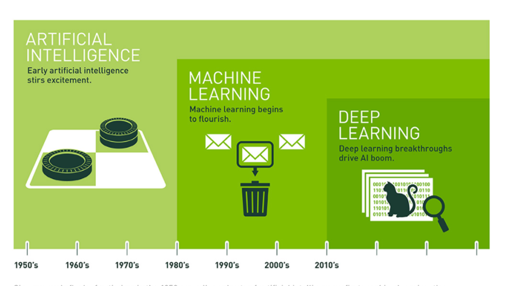

> Vidath Dissanayake | Sri Lanka
> Links: [README](../README.md)

# History of AI

## Evolution of AI

## 1956 Dartmouth Conference

This was a conference among the leading scientists at the time at the Dartmouth University. The term Artificial Intelligence (AI) was coined in 1956 Dartmouth Conference.

## Traditional Programming vs ML

## Current Solutions

- Recommendation Systems
- Computer Vision
- Natural Language Processing
- Language Translation
- Clustering
- Forecasting