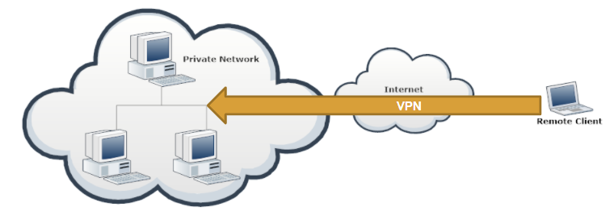

# Virtual Private Network (VPN)

> Vidath Dissanayake | Sri Lanka

A VPN uses [cryptography](../../cryptography.md) to extend a [private network](../../../network/types%20of%20networks/private%20network.md) over a [public network](../../../network/types%20of%20networks/public%20network.md) like [the Internet](../../../network/the%20Internet/the%20Internet.md). This is done by making a protected connection to a [private network](../../../network/types%20of%20networks/private%20network.md), such as an office or home network. To a client, connecting via a VPN will be the same as connecting directly to the [private network](../../../network/types%20of%20networks/private%20network.md).

When you connect via a VPN, you are actually running the same protocols you would have run, if you were in a [private network](../../../network/types%20of%20networks/private%20network.md). This allows you to perform even low level network operations such as [sniffing](../../../hacking/attacks%20and%20vulnerabilities/network/sniffing/sniffing.md) with [Wireshark](../../../tools/hacking/network/wireshark/Wireshark.md).