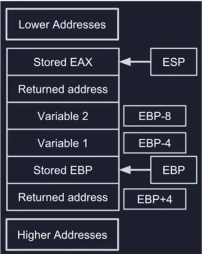

# Assembly

> Vidath Dissanayake | Sri Lanka

## The Stack
 
The Stack refers to Last in First Our (LIFO) data structure. It stores local variables and return addresses for functions. The stack is accessed through PUSH, POP, CALL and RET instructions. In the RAM memoy layout, it starts at a higher memory address and as more values are pushed, smaller and smaller addresses are used.

