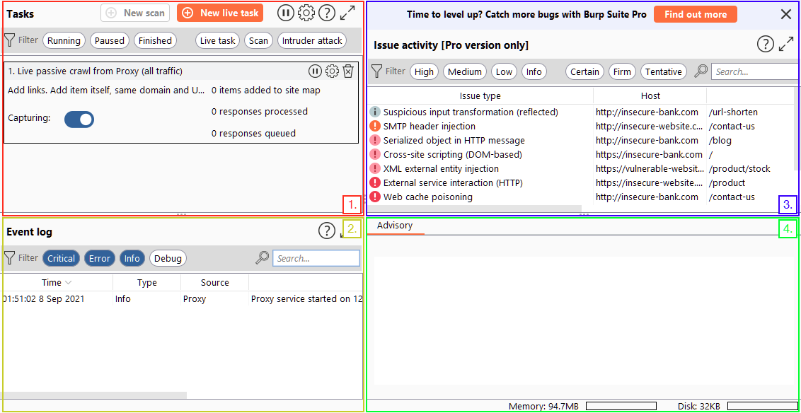

# Burp Suite Dashboard

> Vidath Dissanayake | Sri Lanka

The [Burp Suite](../../Burp%20Suite.md) Dashboard consists of 4 quadrants. 

1.  The Tasks menu allows us to define background tasks that [Burp Suite](../../Burp%20Suite.md) will run.
2.  The Event log tells us what [Burp Suite](../../Burp%20Suite.md) is doing (e.g. starting the [Proxy](../Proxy/Proxy.md)), as well as information about any connections that we are making through Burp.
3.  The Issue Activity section is exclusive to [Burp Suite Professional Edition](../../editions.md#Burp%20Suite%20Professional%20Edition) and will list all the vulnerabilities found by the automated scanner. These would be ranked by severity and filterable by how sure Burp is that the component is vulnerable.
4.  The Advisory section gives more information about the vulnerabilities found, as well as references and suggested remediations. These could then be exported into a report.