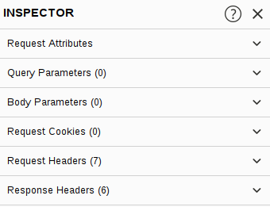

# Inspector

> Vidath Dissanayake | Sri Lanka

Inspector available in both [Proxy](Proxy/Proxy.md) and [Repeater](Repeater/Repeater.md) provides a high level overview of [HTTP](../../../../../network/communication%20protocol/TCP%20IP%20layer%204/OSI%20layer%207/HTTP.md) requests and responses.

Of these, the request sections can nearly always be altered, allowing us to add, edit, and delete items. 

For example, in the Request Attributes section, we can edit the parts of the request that deal with location, method and protocol; e.g. changing the resource we are looking to retrieve, altering the request from GET to another HTTP method, or switching protocol from HTTP/1 to HTTP/2:

The other sections available for viewing and/or editing are:  

-   **Query Parameters**, which refer to data being sent to the server in the URL. For example, in a GET request to `https://admin.tryhackme.com/?redirect=false`, there is a query parameter called "redirect" with a value of "false".  
-   **Body Parameters**, which do the same thing as Query Parameters, but for POST requests. Anything that we send as data in a POST request will show up in this section, once again allowing us to modify the parameters before re-sending.
-   **Request Cookies** contain, as you may expect, a modifiable list of the cookies which are being sent with each request.
-   **Request Headers** allow us to view, access, and modify (including outright adding or removing) any of the headers being sent with our requests. Editing these can be very useful when attempting to see how a webserver will respond to unexpected headers.  
    
-   **Response Headers** show us the headers that the server sent back in response to our request. These cannot be edited (as we can't control what headers the server returns to us!). Note that this section will only show up after we have sent the request and received a response.