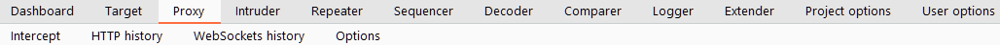

# Navigation in Burp Suite

> Vidath Dissanayake | Sri Lanka
> Tags: #tools/hacking/web_app
> Links: [Burp Suite](Burp%20Suite.md)

Navigating around the [Burp Suite](Burp%20Suite.md) GUI by default is done entirely using the top menu bars:

These allow to switch between [modules](modules/modules.md).

These tabs can also be detached into separate windows. This can be done by clicking "Window" in the application menu at the top of the screen, then choosing to "Detach" tabs:

These can be reattached in the same way or by closing the detached window.

Sub-tabs of [modules](modules/modules.md) can be selected from the second menu bar that will appear below the first one. These usually provide module specific settings.

In addition to the menu bar, [Burp Suite](Burp%20Suite.md) also has keyboard shortcuts that allow quick navigation to key tabs. By default, these are:

| Shortcut           | Does                                                          |
| ------------------ | ------------------------------------------------------------- |
| `Ctrl + Shift + D` | Switch to the [Dashboard](modules/Dashboard/Dashboard.md) tab |
| `Ctrl + Shift + T` | Switch to the [Target](modules/Target/Target.md) tab          |
| `Ctrl + Shift + P` | Switch to the [Proxy](modules/Proxy/Proxy.md) tab             |
| `Ctrl + Shift + I` | Switch to the [Intruder](modules/Intruder/Intruder.md) tab    |
| `Ctrl + Shift + R` | Switch to the [Repeater](modules/Repeater/Repeater.md) tab    |
