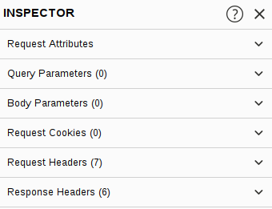

# Inspector

Inspector available in both [Proxy](proxy/Proxy.md) and [Repeater](repeater/Repeater.md) provides a high level overview of HTTP requests and responses.

Of these, the request sections can nearly always be altered, allowing us to add, edit, and delete items. 

For example, in the Request Attributes section, we can edit the parts of the request that deal with location, method and protocol; e.g. changing the resource we are looking to retrieve, altering the request from GET to another HTTP method, or switching protocol from HTTP/1 to HTTP/2:

