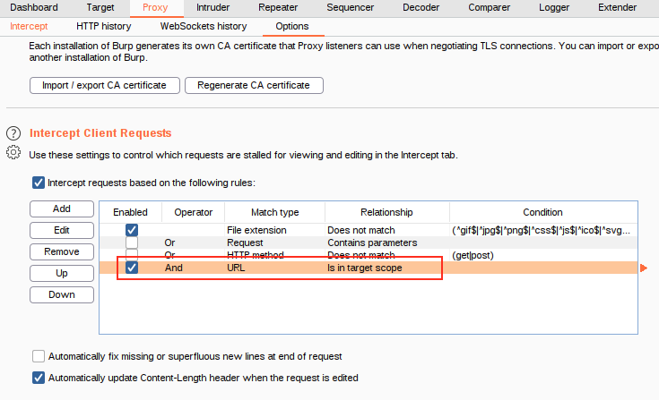

# Scoping

If [Burp Suite](Burp%20Suite.md) is capturing all traffic that goes through the [Proxy](Proxy.md), things can get cluttered.

The solution to this is scoping.

## Disabling Logging of Out of Scope Targets

Setting a scope for the project allows us to define what gets proxied and logged. We can restrict Burp Suite to only target the web application(s) that we want to test.

The easiest way to do this is by switching over to the [Target](Target.md) tab, right-clicking our target from our list on the sitemap, then choosing "Add To Scope". 

Burp will then ask us whether we want to stop logging anything which isn't in scope -- most of the time we want to choose "yes" here.

## Disabling Intercept of Out of Scope Targets

Even though we disabled logging, that doesn't stop Burp Proxy from [intercepting](Proxy#Intercept) out of scope traffic. 

To turn this off, we need to go into the [Options](Proxy#Options) sub-tab in [Proxy](Proxy.md) and select "`And URL Is in target scope`" from the Intercept Client Requests section:
