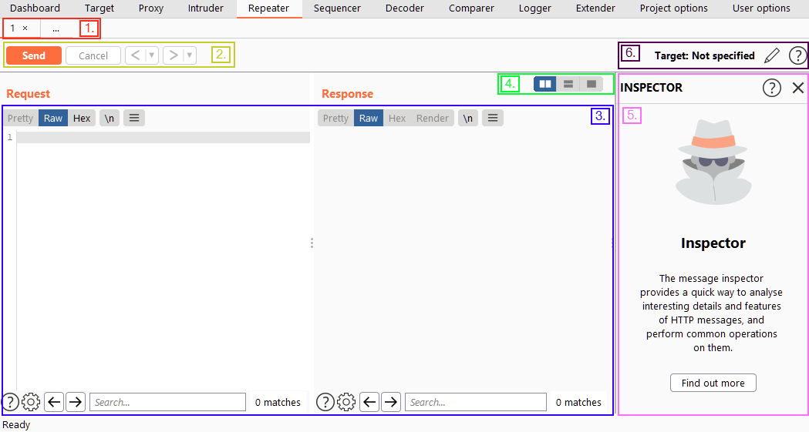

# Burp Suite Repeater

Repeater is a [Burp Suite](Burp%20Suite.md) [module](modules.md) that allows us to craft and/or relay intercepted requests to a target at will.

It also provides a GUI for writing the request payload and numerous views (including a rendering engine for a graphical view) of the response.

The Repeater interface can be split into six main sections:
1.  At the very top left of the tab, we have a list of Repeater requests. We can have many requests going through Repeater: each time we send a new request to Repeater, it will appear up here.
2.  Directly underneath the request list, we have the controls for the current request. These allow us to send a request, cancel a hanging request, and go forwards/backwards in the request history.
3.  Still on the left-hand side of the tab, but taking up most of the window, we have the request and response view. We edit the request in the Request view, then press send. The response will show up in the Response view.
4.  Above the request/response section, on the right-hand side, is a set of options allowing us to change the layout for the request and response views. By default, this is usually side-by-side (horizontal layout). However, we can also choose to put them above/below each other (vertical layout) or in separate tabs (combined view).
5.  At the right-hand side of the window, we have the Inspector, which allows us to break requests apart to analyse and edit them in a slightly more intuitive way than with the raw editor.
6.  Finally, above the Inspector, we have our target. Quite simply, this is the IP address or domain to which we are sending requests. When we send requests to Repeater from other parts of Burp Suite, this will be filled in automatically.

