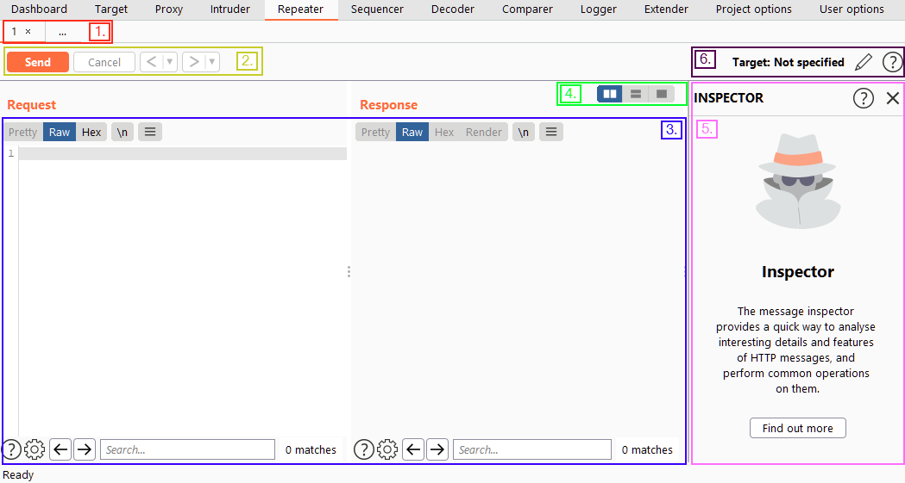

# Repeater Interface

The [Repeater](Repeater.md) interface can be split into six main sections:
1.  At the very top left of the tab, we have a list of [Repeater](Repeater.md) requests. We can have many requests going through [Repeater](Repeater.md): each time we send a new request to [Repeater](Repeater.md), it will appear up here.
2.  Directly underneath the request list, we have the controls for the current request. These allow us to send a request, cancel a hanging request, and go forwards/backwards in the request history.
3.  Still on the left-hand side of the tab, but taking up most of the window, we have the request and response view. We edit the request in the Request view, then press send. The response will show up in the Response view. These can be presented in various [views](views.md).
4.  Above the request/response section, on the right-hand side, is a set of options allowing us to change the layout for the request and response [views](views.md). By default, this is usually side-by-side (horizontal layout). However, we can also choose to put them above/below each other (vertical layout) or in separate tabs (combined view).
5.  At the right-hand side of the window, we have the [Inspector](../Inspector.md), which allows us to break requests apart to analyse and edit them in a slightly more intuitive way than with the raw editor.
6.  Finally, above the [Inspector](../Inspector.md), we have our target. Quite simply, this is the [IP address](../../../../../../networking/IP%20address.md) or domain to which we are sending requests. When we send requests to [Repeater](Repeater.md) from other parts of [Burp Suite](../../Burp%20Suite.md), this will be filled in automatically.

