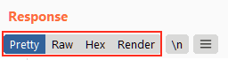

# Response and Request Views

Repeater offers us various ways to present the responses to our requests -- these range from hex output all the way up to a fully rendered version of the page.

We can see the available options by looking above the response box:

  

We have four display options here:

1.  **Pretty:** This is the default option. It takes the raw response and attempts to beautify it slightly, making it easier to read.
2.  **Raw:** The pure, un-beautified response from the server.
3.  **Hex:** This view takes the raw response and gives us a byte view of it -- especially useful if the response is a binary file.
4.  **Render (Only for response):** The render view renders the page as it would appear in your browser.

